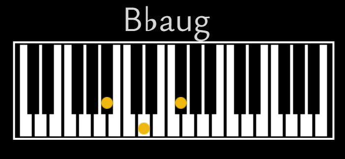

# Acordes

Acordes es una herramienta interactiva diseñada para facilitar el estudio y la práctica de acordes musicales. Esta aplicación, desarrollada en JavaScript, está destinada a ayudar a estudiantes principiantes o intermedios, que desean mejorar sus habilidades en la identificación y reproducción de acordes.

[![Static Badge](https://img.shields.io/badge/acordes-%23efb810?logo=data%3Aimage%2Fsvg%2Bxml%3Bbase64%2CPD94bWwgdmVyc2lvbj0iMS4wIiBlbmNvZGluZz0iVVRGLTgiPz4KPCFET0NUWVBFIHN2ZyBQVUJMSUMgIi0vL1czQy8vRFREIFNWRyAxLjEvL0VOIiAiaHR0cDovL3d3dy53My5vcmcvR3JhcGhpY3MvU1ZHLzEuMS9EVEQvc3ZnMTEuZHRkIj4KPHN2ZyB4bWxucz0iaHR0cDovL3d3dy53My5vcmcvMjAwMC9zdmciIHZlcnNpb249IjEuMSIgd2lkdGg9IjgwMHB4IiBoZWlnaHQ9IjgwMHB4IiBzdHlsZT0ic2hhcGUtcmVuZGVyaW5nOmdlb21ldHJpY1ByZWNpc2lvbjsgdGV4dC1yZW5kZXJpbmc6Z2VvbWV0cmljUHJlY2lzaW9uOyBpbWFnZS1yZW5kZXJpbmc6b3B0aW1pemVRdWFsaXR5OyBmaWxsLXJ1bGU6ZXZlbm9kZDsgY2xpcC1ydWxlOmV2ZW5vZGQiIHhtbG5zOnhsaW5rPSJodHRwOi8vd3d3LnczLm9yZy8xOTk5L3hsaW5rIj4KPGc%2BPHBhdGggc3R5bGU9Im9wYWNpdHk6MC45ODgiIGZpbGw9IiNlZmI4MGYiIGQ9Ik0gMzg0LjUsMTUwLjUgQyAzODcuNzMxLDE1Mi4yMiAzOTAuNTY0LDE1NC41NTMgMzkzLDE1Ny41QyA0MDIuNTU2LDE2OC4wNTEgNDExLjcyMiwxNzguODg1IDQyMC41LDE5MEMgNDEwLjg3NiwyMDAuNjI1IDQwMC44NzYsMjEwLjk1OSAzOTAuNSwyMjFDIDQxMC4zNCwyNTAuODE2IDQxOC4xNzQsMjgzLjY1IDQxNCwzMTkuNUMgNDA3LjQ2NCwzNjguMDg4IDM4My42MzEsNDA1LjU4OCAzNDIuNSw0MzJDIDMwOS42MzEsNDUxLjI3MSAyNzQuMjk4LDQ1Ny45MzcgMjM2LjUsNDUyQyAyMTYuMjYsNDQ5LjEyMiAxOTcuNzYsNDQxLjk1NiAxODEsNDMwLjVDIDE3MC42MzcsNDQxLjE5NyAxNTkuOTcxLDQ1MS41MyAxNDksNDYxLjVDIDEzNi42NSw0NDguNjUxIDEyNC40ODMsNDM1LjY1MSAxMTIuNSw0MjIuNUMgMTIxLjgzMyw0MTIuODMzIDEzMS4xNjcsNDAzLjE2NyAxNDAuNSwzOTMuNUMgMTIwLjQzOSwzNjYuOTc5IDExMC43NzIsMzM2Ljk3OSAxMTEuNSwzMDMuNUMgMTE0LjM0NCwyMzguNTE2IDE0NS4wMTEsMTkyLjAxNiAyMDMuNSwxNjRDIDI0My44NDksMTQ4LjY5IDI4NC4xODIsMTQ4LjY5IDMyNC41LDE2NEMgMzM0Ljc1MiwxNjguNzA1IDM0NC4yNTIsMTc0LjUzOCAzNTMsMTgxLjVDIDM2NC4wMDUsMTcxLjY2MSAzNzQuNTA1LDE2MS4zMjggMzg0LjUsMTUwLjUgWiBNIDI1Ny41LDIwOS41IEMgMjc3LjI0OCwyMDguNDggMjk1LjU4MSwyMTIuOTggMzEyLjUsMjIzQyAyNjkuMjc5LDI2Ni41NTUgMjI1Ljc3OSwzMDkuNzIyIDE4MiwzNTIuNUMgMTc3Ljk0NiwzNDcuMDU4IDE3NC45NDYsMzQxLjA1OCAxNzMsMzM0LjVDIDE2MC43NzIsMjg1LjgyMyAxNzUuNjA1LDI0Ny45ODkgMjE3LjUsMjIxQyAyMzAuMTcyLDIxNC4zODEgMjQzLjUwNiwyMTAuNTQ4IDI1Ny41LDIwOS41IFogTSAzNDguNSwyNjMuNSBDIDM1Mi40NTksMjY5Ljg2OSAzNTQuOTU5LDI3Ni44NjkgMzU2LDI4NC41QyAzNjIuMTg4LDMzMy4zIDM0My4zNTUsMzY4LjQ2NyAyOTkuNSwzOTBDIDI3OC41NTQsMzk3LjA2OCAyNTcuMjIxLDM5OC40MDEgMjM1LjUsMzk0QyAyMzEuMDEsMzkyLjcyNiAyMjYuNjc3LDM5MS4wNTkgMjIyLjUsMzg5QyAyNjQuMzk1LDM0Ni45MzggMzA2LjM5NSwzMDUuMTA1IDM0OC41LDI2My41IFoiLz48L2c%2BCjxnPjxwYXRoIHN0eWxlPSJvcGFjaXR5OjAuOTgzIiBmaWxsPSIjZWZiODBmIiBkPSJNIDQ0OC41LDI2MS41IEMgNTI4LjUsMjYxLjUgNjA4LjUsMjYxLjUgNjg4LjUsMjYxLjVDIDY4Mi4yMzQsMjc3Ljk1OCA2NzUuNTY3LDI5NC4yOTEgNjY4LjUsMzEwLjVDIDY3MS44NzEsMzEyLjg0NiA2NzUuMjA0LDMxNS4xNzkgNjc4LjUsMzE3LjVDIDY3My40LDMxNy45MSA2NjguNTY2LDMxOC45MSA2NjQsMzIwLjVDIDYxNy43NTUsNDMwLjU5MyA1NzAuNzU1LDU0MC4yNiA1MjMsNjQ5LjVDIDUwNS4yLDY0My44NDMgNDg3LjcsNjM3LjUxIDQ3MC41LDYzMC41QyA1MTYuMDM4LDUyNi41OTMgNTYxLjcwNCw0MjIuNzU5IDYwNy41LDMxOUMgNTUyLjUwMSwzMTguNSA0OTcuNTAxLDMxOC4zMzMgNDQyLjUsMzE4LjVDIDQ0NC4zMDQsMjk5LjQ2MiA0NDYuMzA0LDI4MC40NjIgNDQ4LjUsMjYxLjUgWiIvPjwvZz4KPC9zdmc%2BCg%3D%3D&labelColor=%23ffffd7)](http://www.niupleis.com/projects/acordes) [](https://ko-fi.com/niupleis)


El propósito es ofrecer una plataforma dinámica que haga del aprendizaje de acordes una experiencia atractiva y memorable. A través de la generación aleatoria de acordes y la visualización opcional de notas en un piano virtual, la aplicación utiliza la técnica de repetición espaciada para optimizar el proceso de aprendizaje, para permitir consolidar conocimientos de manera progresiva y efectiva.

*Los archivos [acordesM.js](/acordesM.js) y [styleM.js](/styleM.css) son para una version diferente de estilo para poder usar más comodamente en dispositivos móviles, para desactivar hay que modificar la línea `<link rel="stylesheet" media="only screen and (max-width: 719px)" href="styleM.css">` en el archivo [index.html](/index.html)*

#### Contenidos
<a href="#instalacion">Instalación</a><br>
├<a href="#uso">Uso</a><br>
│└ <a href="#interfaz">Interfaz</a><br>
└ <a href="#comoFunciona">Como Funciona</a><br>
. ├ <a href="#condiciones">Condiciones</a><br>
. ├ <a href="#condicionesEspeciales">Condiciones especiales</a><br>
. ├ <a href="#displayDeAcordes">Mostrar acorde</a><br>
. ├ <a href="#displayDeNotas">Mostrar notas</a><br>
. ├ <a href="#mostrarEscalaModal">Mostrar escala modal</a><br>
. └ <a href="#otrasFunciones">Otro</a><br>

<h2 id="instalacion">Instalación</h2>

La instalación de Acordes es opconal, puedes probarla en linea [aquí](http://www.niupleis.com/projects/acordes/)

Si deseas descargarlo localmente simplemente clona este repositorio o descarga el [zip](https://github.com/tnkii-dev/acordes/archive/refs/heads/main.zip), Se ejecuta directamente en tu navegador sin necesidad de instalaciones adicionales o de un servidor, arrastrando el archivo [index.html](/index.html) al navegador.

<h2 id="uso">Uso</h2>

La interfaz permite configurar el acorde generado para ajustarse al nivel de habilidad del usuario.

### Configuración

En esta seccíón se configura la clase de acordes que se mostraran en el display, abarca una gran cantidad de simbolos de acordes. Los de Triadas simples, los de Septimas, de PowerChords, De Sextas, notas Suspendidas, Miscalaneas, Extensiones y Alteraciones. Aparte una configuración especial para estudiar escalas modales.


### Display

EL display tiene dos partes: El nombre de acorde y las notas del acorde.


La primera muestra el acorde generado cada que se corre el programa al hacer click en el boton `Generar acorde` o al presionar la tecla `space`.


La segunda parte es el piano virtual que muestra las notas que corresponden al acorde generado, está oculto por defecto, y se puede cambiar su visibilidad al hacer click el botón `Mostrar acorde` o al presionar la tecla `enter`.

<h3 id="interfaz">Interfaz</h3>

#### Casilla 'Escalas'.

Esta casilla simplemente se encarga de activar los simbolos de escala en el display, si se activa sola sin ningún otra casilla, a aplicaión interpretará la configuración com si fuera una triada mayor, en música un simbolo de nota sin acorde se interpreta como un acorde mayor.
Se activa por defecto y cada que se activa otra opción, perfectamente se puede desactivar pero la aplicaión será inutilizable.

`C, C#, D♭, D, D#, E♭, E, F, F#, G♭, G, G#, A♭, A, A#, B♭, B`
<br>


#### Casilla 'Triada'.

Esta casilla activa los simolos de cuatro tipos de acorde:
*Acordes mayores*
`maj, M`
*Acordes menores*
`min, m, -`
*Acordes disminuídos*
`dim, °`
*Acordes aumentados*
`aug, (#5), +`
<br>


#### Casilla 'Septima'.

Esta casilla activa los simbolos de acorde con septima mayor, menor, disminuída y semi-disminuída.
`7, △, M7, ⌀7, 7(♭5)`
Y también los simbolos de novenas, onceavas y  treceavas singulares (Las que no necesitan añadir el acorde se septima completo).
`add9, add11, add13`


#### Casilla 'Power Chords'

Añade simbolos de powerchords (acordes de dos notas)
`5, 3`


#### Casilla 'Sextas'

Añade todos los simbolos que contienen o añaden sextas al acorde
`6, (add♭6), (♭6), ⁶₉`
El simbolo `⁶₉` añade también una novena al acorde


#### Casilla 'Suspendidas'

Añade los simbolos de acordes con notas suspendidas
`sus, sus4, sus2`


#### Casilla 'Miscelaneas'

Aveces hay convinaciónes de notas que no tienen una escritura estandarizada y lo que hace es encontrar una manera lógica de describirla, para eso se usan estos símbolos oscuros
`2, (add2)`


#### Casilla 'Extensiones'

Esta casilla activa los simbolos de acordes extendidos, novenas, onceavas y treceavas completas (Las que si añaden septimas, novenas y onceavas)
`9, 7(add9), 11 y 13`

Estos hacen terceras y quintas opcionales, ya que a menudo el interprete omite notas, tambien se omiten con los simbolos de la siguiente casilla.


#### Casilla 'Alteraciones'

Esta añade simbolos que alteran un acorde.
Las que piden al interprete omitir notas
`(omit5), (no5), (omit7), (no7)`
Y las que piden aumentar o disminuír notas un semitono
`(#9), (♭9), (#11), (♭11), (#13) y (♭13)`


#### Casilla 'Inversiones'

Devería modificar las notas en el display para mostrar un acorde invertido, actualmente no funciona, la función será agregada en el futuro.

#### Casilla 'Escala modal'

Esta casilla se utiliza independientemente de todas las demás, esta no genera acordes, esta genera una escala modal, es decir, enseña todas las notas de la escala a partir de la nota generada. Y puede generar escalas en todos los modos:
`jonico, dorico, frigio, lidio, mixolidio, eolico, locrio`


<h2 id="comoFunciona">Como funciona</h2>

Aquí explicaré el funcionamiento sin entrar en detalles, para poder entender cada parte será necesario revisar [acordes.js](/acordes.js/)

<h3 id="funciones">Funciones</h3>
Este es el framework con el que se generan y muestran los acordes:

```markdown
generarAcorde();
│
crear arreglos de notas, figuras y opciones
│
obtener la configuración de la interfaz y validarla
│
empezar a generar acorde y limpiar la pantalla
│
├ Si la opción de Escala está marcada:
│├ Elegir una nota aleatoria de la escala
│├ Mostrar la nota en la interfaz
│└ Mostrar la tercera y la quinta si están seleccionadas
│
├ Si la opción de Triadas está marcada y no se eligió una tercera:
│├ Elegir una triada aleatoria
│├ Mostrar la triada en la interfaz
│├ Ocultar la tercera y la quinta si están seleccionadas
│└ Actualizar la escala si es necesario
│
├ Si la opción de Séptimas está marcada y no se eligió una séptima:
│├ Elegir una séptima aleatoria
│├ Mostrar la séptima en la interfaz
│└ Actualizar la tercera y la quinta si es necesario
│
├ Si la opción de Power Chords está marcada y no se eligió un power chord:
│├ Elegir un power chord aleatorio
│├ Mostrar el power chord en la interfaz
│└ Actualizar la tercera y la quinta si es necesario
│
├ Si la opción de Sextas está marcada y no se eligió una sexta:
│├ Elegir una sexta aleatoria
│├ Mostrar la sexta en la interfaz
│└ Actualizar la tercera y la quinta si es necesario
│
├ Si la opción de Suspendidas está marcada y no se eligió una suspendida:
│├ Elegir una suspendida aleatoria
│├ Mostrar la suspendida en la interfaz
│└ Actualizar la tercera y la quinta si es necesario
│
├ Si la opción de Extensiones está marcada y no se eligió una extensión:
│├ Elegir una extensión aleatoria
│├ Mostrar la extensión en la interfaz
│└ Actualizar la tercera y la quinta si es necesario
│
├ Si la opción de Alteraciones está marcada y no se eligió una alteración:
│├ Elegir una alteración aleatoria
│└ Aplicar la alteración en la interfaz según las reglas establecidas
│
├ Si solo la opción de Escala Modal está marcada:
│├ Elegir una escala aleatoria
│└ Mostrar la escala en la interfaz
...
```

<h4 id="condiciones">Condiciones</h4>

La primera parte contiene "look-up tables" de todos los simbolos que se pueden aparecer en el display
```javascript
  const escalas = ["C", "C#", "D", "D#", "E", "F", "F#", "G", "G#", "A", "A#", "B"];
  const triadas = ["maj", "M", "m", "min", "-", "aug", "+", "(#5)", "dim", "°"];
  const septimas = ["7", "△", "△7", "M7", "⌀7", "7(♭5)", "(add9)", "(add11)", "(add13)"];
  const powerChords = ["5", "3"];
  const sextas = ["6", "(add♭6)", "(♭6)", "⁶₉"];
  const miscelaneas = ["2", "(add2)"];
  const alts = ["b9", "#9", "b5", "#5", "b13"];
  const suspendidas = ["sus", "sus4", "sus2"];
  const extensiones = ["9", "7(add9)", "11", "13"];
  const alteraciones = ["(omit5)", "(no5)", "(omit7)", "(no7)", "(#9)", "(♭9)", "(#11)", "(♭11)", "(#13)", "(♭13)"];
  const invertidas = ["/C", "/D", "/E", "/F", "/G", "/A", "B/", "/C#", "/D#", "/F#", "/G#", "/A#"];
  const arpegiosModales = [" jonico", " dorico", " frigio", " lidio", " mixolidio", " eolico", " locrio"];
```
La siguiente guarda en variables el estatus de la interfaz
```javascript
  const escalaCheckbox = document.getElementById("escalasCheckbox").checked;
  const triadasCheckbox = document.getElementById("triadasCheckbox").checked;
  const septimasCheckbox = document.getElementById("septimasCheckbox").checked;
  const powerChordsCheckbox = document.getElementById("powerChordsCheckbox").checked;
  const sextasCheckbox = document.getElementById("sextasCheckbox").checked;
  //const alteradasCheckbox = document.getElementById("alteradasCheckbox").checked;
  const suspendidasCheckbox = document.getElementById("suspendidasCheckbox").checked;
  const extensionesCheckbox = document.getElementById("extensionesCheckbox").checked;
  const alteracionesCheckbox = document.getElementById("alteracionesCheckbox").checked;
  const inversionesCheckbox = document.getElementById("inversionesCheckbox").checked;
  const miscelaneasCheckbox = document.getElementById("miscelaneasCheckbox").checked;
  const arpegioModalCheckbox = document.getElementById("arpegioModalCheckbox").checked;
```
Luego se valida que al menos una checkbox esté activada
```javascript
  if (!(escalaCheckbox || arpegioModalCheckbox || triadasCheckbox || septimasCheckbox ||
        powerChordsCheckbox || sextasCheckbox || /*alteradasCheckbox ||*/ suspendidasCheckbox ||
        extensionesCheckbox|| alteracionesCheckbox || inversionesCheckbox || miscelaneasCheckbox)) {
    alert("Selecciona almenos una ._.");
    return;
  }
```
Lo siguiente es crear la tabla donde se guardarán todas los simbolos para juntar con `.join` al final.

```javascript
  let acorde = [];
  ```

*A partir de aquí empieza la geneación del acorde y la union de simbolos*

Primero se selecciona un simbolo random de la tabla de simbolos de escalas y si es un simbolo de sostenido `#` se cambia a uno de `♭` el 50% de la veces.
```javascript
  if (escalaCheckbox) {
    escala = escalas[Math.floor(Math.random() * escalas.length)];
    if(escala == "C#" && Math.floor(Math.random()*2)==1){
        escala="D♭"
    }; // Esto es un fragmento de ejemplo
    acorde.push(escala);
  }
```

Luego se generan simbolos para triadas, septimas, powerChords, sextas, suspendidas y miscelaneas con probabilidad de 1 a 4,
```javascript
  if (triadasCheckbox && Math.floor(Math.random()*4)+1!=2) {
    triada = triadas[Math.floor(Math.random() * triadas.length)]
    // Aqui se comprueban los simbolos especificos para aplicar condiciones especiales "if (triada == "'maj'){}"
    acorde.push(triada);
  }
  // Este ejemplo es de 'triadas', aplica de manera similar para los tipos de acorde mencionados
```

*Las extensiones y alteraciones funcionan diferente ya que requieren condiciones especiales para funcionar pero comparten probabilidades y comprobaciones especificas.*

*El modo Arpegio Modal tambien requiere condiciones especificas ya que funciona diferente.*

Finalmente se juntan los acordes resultantes y se actualiza el objeto en la página para mostrar el acorde.
```javascript
  const resultadoElement = document.getElementById("resultado");
  resultadoElement.textContent = acorde.join("");
```

```html
  <button onclick="generarAcorde()">Generar Acorde (space)</button>
  <div style="font-size: 48px;" id="resultado"></div>
```
<h4 id="condicionesEspeciales">Condiciones especiales y simbolos especificos</h4>

Al generar triadas, power chords, suspendidas y miscelaneas no se requieren condiciones especiales.

Al generar septimas se verifica el tipo de acorde para reemplazar las notas en el display correctamente.

```javascript
... else if (septima == "M7" && (triada=="min"||triada=="m")) { ...
```


Al generar sextas de tipo (♭6) y (add♭6) se verifica si el acorde generado es menor, si lo es se procede a mostrar el acorde, si no lo es se ignora la sexta.

```javascript
... else if (sexta == "(add♭6)" && (es == "menor" || !triada)) { ...
```

Al generar extensiones se ignoran las configuraciones que no sean de escalas, triadas y septimas porque las extensiones agregan automaticamente septimas, novenas, onceavas y/o treceavas, también agrega automaticamente terceras y quintas que se pueden omitir.

```javascript
//limpiar el acorde prácticamente
acorde = [];
second.style.display = "none";
sixth.style.display = "none";
eleventh.style.display = "none";
thirteen.style.display = "none";
acorde.push(escala);
```

Al generar alteraciones se valida si es que las extensiones han agregado figuras porque en extensiones se agregan septimas, novenas y oceavas las cuales se modifican cuando laa alteración es de tipo sostenido '#' o bemol '♭'.

```javascript
    if (alteracion == "(omit5)" && septima) { ...
    } else if (alteracion == "(no5)" && (septima || extension)) { ...
    } else if (alteracion == "(omit7)" && (!triada || !septima) && extension !="7(add9)" && extension) { ...
    } else if (alteracion == "(no7)" && (!triada || !septima) && extension) { ...
    } else if (alteracion == "(#9)" && extension == "7") { ...
    } else if (alteracion == "(♭9)" && extension == "7") { ...
    } else if (alteracion == "(#11)" && extension == "9") { ...
    } else if (alteracion == "(♭11)" && extension == "9") { ...
    } else if (alteracion == "(#13)" && extension == "11") { ...
    } else if (alteracion == "(♭13)" && extension == "11") { ...
    }
```

<h4 id="displayDeAcordes">Mostrar acorde</h4>

Simplemente juntamos todos los elementos de `acorde[]` y se muestra o reemplaza el elemento de display en el archivo html

```javascript
  const resultadoElement = document.getElementById("resultado");
  resultadoElement.textContent = acorde.join("");
```

<h4 id="displayDeNotas">Mostrar notas</h4>

Para mostrar las notas en el display del piano se hacen en dos pasos

##### 1. Los elementos en pantalla (html & css)

Primero agregamos la textura del piano virtual

```javascript

```

Luego se crean elementos por cada intervalo directamente en la página.
Se le asigna una ID de '1st' a '13th', se le gregan estilos especificos:
`position: fxed;` Para asignarle una posicion especifica más adelante.
`display: none;` Para mostrar solo los necesarios.
`translate: ;` & `top: ;` Para que no rompan el flujo mientras se les asigna un valor

```html
<div id="1st" style="position: fixed; display: none; translate: -213px; top: 100px;"></div>
```

##### 2. Mostrarlos en el lugar correcto (javascript)

Primero declaramos las posiciones de cada tecla virtual en el piano

```javascript
  const tops = ["110px", "75px", "110px", "75px", "110px", "110px", "75px", "110px", "75px",
  "110px", "75px", "110px", "110px", "75px", "110px", "75px", "110px", "110px", "75px", "110px",
  "75px", "110px", "75px", "110px", "110px", "75px", "110px", "75px", "110px", "110px", "75px",
  "110px", "75px", "110px", "75px", "110px"];
  const translations = ["-213px", "-203px", "-193px", "-183px", "-173px", "-153px", "-143px",
  "-133px", "-123px", "-113px","-103px", "-93px", "-73px", "-63px", "-53px", "-43px", "-33px",
  "-13px", "-03px", "7px", "17px", "27px", "37px", "47px", "67px", "77px", "87px", "97px",
  "107px", "127px", "137px", "147px", "157px", "167px", "177px", "187px"];
```

Sé que parece mucha repetición pero tiene sentido muical, mirad a `tops[]` son 2 tipos de dato '110' & '75' y están organizados como las teclas blancas y negras en el piano, y se repiten 3 veces para abarcar las 3 octavas del piano virtual.

`110px` Son las notas blancas.
`75px` Son las notas negras.

Similarmente con `translations[]` que contiene las posiciones que devería tener cada sprite encima del piano virtual.

Lo siguiente es crear los objetos de cada intervalo y poner el sprite de la nota activa a los intervalos a partir de '2nd'.

```javascript
  let root = document.getElementById("1st"); root.style.display = "none";
  let second = document.getElementById("2maj"); second.style.display = "none";
  ...

  second.innerHTML = "";
  ...
```

`root` será definida por la nota en escala, ese es el paso siguiente y es quizás el paso más importante

```javascript
    if (escala == "C") {root.style.display = "flex"; root.style.top = tops[0]; root.style.translate = translations[0]; root=0;}
    else if (escala == "C#") {root.style.display = "flex"; root.style.top = tops[1]; root.style.translate = translations[1]; root=1; if(Math.floor(Math.random()*2)+1==2){escala="D♭"};}
    else if (escala == "D") {root.style.display = "flex"; root.style.top = tops[2]; root.style.translate = translations[2]; root=2;}
    else if (escala == "D#") {root.style.display = "flex"; root.style.top = tops[3]; root.style.translate = translations[3]; root=3; if(Math.floor(Math.random()*2)+1==2){escala="E♭"};}
    else if (escala == "E") {root.style.display = "flex"; root.style.top = tops[4]; root.style.translate = translations[4]; root=4;}
    else if (escala == "F") {root.style.display = "flex"; root.style.top = tops[5]; root.style.translate = translations[5]; root=5;}
    else if (escala == "F#") {root.style.display = "flex"; root.style.top = tops[6]; root.style.translate = translations[6]; root=6; if(Math.floor(Math.random()*2)+1==2){escala="G♭"};}
    else if (escala == "G") {root.style.display = "flex"; root.style.top = tops[7]; root.style.translate = translations[7]; root=7;}
    else if (escala == "G#") {root.style.display = "flex"; root.style.top = tops[8]; root.style.translate = translations[8]; root=8; if(Math.floor(Math.random()*2)+1==2){escala="A♭"};}
    else if (escala == "A") {root.style.display = "flex"; root.style.top = tops[9]; root.style.translate = translations[9]; root=9;}
    else if (escala == "A#") {root.style.display = "flex"; root.style.top = tops[10]; root.style.translate = translations[10]; root=10; if(Math.floor(Math.random()*2)+1==2){escala="B♭"};}
    else if (escala == "B") {root.style.display = "flex"; root.style.top = tops[11]; root.style.translate = translations[11]; root=11;}
    ...
```
<p style='color:#ff0;'>IMPORTANTE</p>
`root = 0` es la variable que permite que todo funcione en terminos de construcción de acordes y escalas.

Ahora analisemos solo un acorde con tercera y con la tónica siendo C para entender como funciona.

```javascript
if (escala == "C") {root.style.display = "flex"; root.style.top = tops[0]; root.style.translate = translations[0]; root=0;}
```

Primero se muestra la tónica en la posicion `translations[0]` & `tops[0]` los cuales apuntan a `-123px` & `110px` que corresponde a C en el piano virtual

Y declara la vriable `root` con el valor  `0`


Y ahora colocamos la siguiente nota:

```javascript
third.style.display = "flex"; third.style.top = tops[root+4]; third.style.translate = translations[root+4];
```

En lugar de posicionarse en una posición específica se posiciona dependiendo del valor de la tónica `translations[root+4]` & `tops[root+4]`


Y cuanto hay que sumar depende de reglas musicales, una tercera mayor siempre está a 4 semitonos de la tónica, si estuvieramos armando un acorde menor, disminuído o bemol hariamos la suma como `[root+3]`, y si se requiere una tercera sostenida hariamos `[root+5]`.


Esto es así para cada intervalo.

<h4 id="mostrarEscalaModal">Mostrar escala modal</h4>

Todo lo que se ha discutido hasta ahora se puede ignorar para la parte del proyecto que mustra escalas modales, ni siquiera devería ser parte de este proyecto pero como fué creado para ayudarme a estudiar jazz lo puse porque estas escalas son importantes.

Funcionaigual que las otras opciones en el modo de mostrar las notas lo unico diferente es que esto muestra 8 notas que corresponden a la escala a la vez, la unica parte importante es esta:

```javascript
if (arpegio == " jonico") { n=[2, 4, 5, 7, 9, 11, 12]
} else if (arpegio == " dorico") { n=[2, 3, 5, 7, 9, 10, 12]
} else if (arpegio == " frigio") { n=[1, 3, 5, 7, 8, 10, 12]
} else if (arpegio == " lidio") { n=[2, 4, 6, 7, 9, 11, 12]
} else if (arpegio == " mixolidio") { n=[2, 4, 5, 7, 9, 10, 12]
} else if (arpegio == " eolico") { n=[2, 3, 5, 7, 8, 10, 12]
} else if (arpegio == " locrio") { n=[1, 3, 5, 6, 8, 10, 12]
};
```

es facil explicar como funciona, miremos a los numeros de `n` si `arpegio` es `"jonico"`:
`2 4 5 7 9 11 12`

La formula de esta suceción es esta: `+2 +2 +1 +2 +2 +2 +1` que es paralelo de `tono, tono, semitono, tono, tono, tono, semitono` un concepto familiar en el estudio de solfeo. 'Jonico' es el nombre moodal de la escala mayor, esta misma lógica se usa para las demás suceciones de las demás escalas modales.

*'lidio' es la escala menor*

<h4 id="otrasFunciones">Otras funciones</h4>

El resto de funciones corresponden a configuraciones de la interfaz:

*`isolateLabel()`*
Esta funcion se asegura de desactivar otras configuraciones al avtivar `Escala Modal`

*`uncheckArpegio()`*
Esta es la contraparte de la función anterior, se encarga de desactivar `Escala Modal` si se activa cualquier otra opción

*`checkLabels()`*
Esta funcion se encarga de activar `Triadas` `Septimas` `Sextas` & `Extensiones` cuando se activa `Alteraciones` ya que ésta necesita al menos una configuración de aquellas activada.

*`mostrarAcorde()`*
Esta función simplemente oculta o muestra el display del piano en caso de que se esté estudiando de memoria